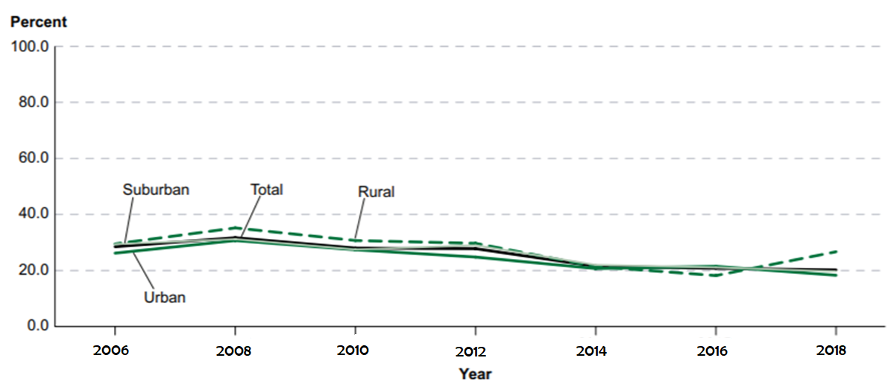

# Fastai implementation of Combat finder 
Combat finder is deep learning algorithm implemented to detect fight scenes from the surveillance footage.
Combat finder is implemented using fastai using resnet architectures (resnet18,resnet 34, resnet 50)

## PRE-REQUISITE:

Install fastai following the instruction in below link and make sure you have installed all the dependencies
https://docs.fast.ai/install.html

## Motivation:

1. "Bullying” in school is a common issue and has been reported in the last few years . The bullying percentile has not decreased
inspite of the recent advancement in technology.

2. Significant number of students have faced fatal injuries, before authorities could intervene.System proposed uses the existing surveillance installed in the public schools. The surveillance footage is analysed to predict fight scenes and alert the authorities.It also requests medical assistance.

### *The bullying statistics based on urbanicity across past few years*

## Approach

   1. Instead of dealing with videos along temporal dimension this project is started with image classification ,i.e the network is designed to classify images with aggresive actions into fight category. Basically there are 8 class labels including hit,kick,push,punch,shoot gun,wave,stand, ride horse where the agressive actions like hit,punch,shootgun,kick belong to "fight" category and others belong to non-fight category

   2. The example images in the Dataset are given below for reference . There are basically extraced from the video HMDB51 dataset and annotated manually.

### *Image examples on our customised dataset*

### *Basic implmentation of combat finder on images using fastai on rresnet architecture*

## Result:

#### *Number of prediction correct to the total number of images across each class*

#### *Accuracy rate across different resnet architectures*

## Big picture and future work
1. Move the network to video input and train the network with lighter models like mobilenet ,squeezenet on video dataset with CCTV footages like NTU_CCTV fights.

